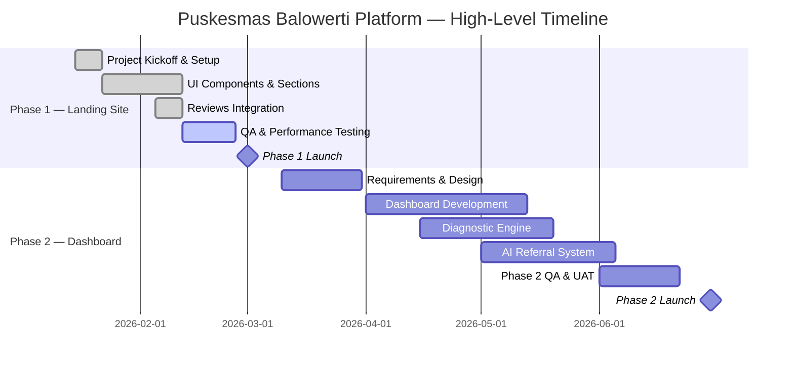

# 00 — PROJECT OVERVIEW
## Architecture & Built by Claudesy

---

| Field | Value |
|---|---|
| **Project** | Puskesmas Balowerti — Premium Healthcare Web Platform |
| **Document** | 00 — Project Overview |
| **Version** | 1.0.0 |
| **Author** | dr. Ferdi Iskandar / Claudesy |
| **Date** | 2026-03-03 |
| **Status** | Active |
| **Classification** | Public / Internal |

---

## Table of Contents

1. [Executive Summary](#1-executive-summary)
2. [Project Background & Context](#2-project-background--context)
3. [Vision & Mission Alignment](#3-vision--mission-alignment)
4. [Objectives](#4-objectives)
5. [Scope of Work](#5-scope-of-work)
6. [Out of Scope](#6-out-of-scope)
7. [Key Performance Indicators (KPIs)](#7-key-performance-indicators-kpis)
8. [Assumptions](#8-assumptions)
9. [Dependencies](#9-dependencies)
10. [Constraints](#10-constraints)
11. [Deliverables Summary](#11-deliverables-summary)
12. [High-Level Timeline](#12-high-level-timeline)
13. [Budget Overview](#13-budget-overview)
14. [Stakeholders at a Glance](#14-stakeholders-at-a-glance)
15. [Acceptance Criteria](#15-acceptance-criteria)
16. [Sign-Off Block](#16-sign-off-block)

---

## 1. Executive Summary

I am leading the design, development, and delivery of the **Puskesmas Balowerti Premium Healthcare Web Platform** — a comprehensive, premium-grade digital presence for Puskesmas Balowerti, a primary healthcare center (Puskesmas) located in Kediri, East Java, Indonesia.

This platform serves two core purposes: (1) a premium, interactive **public-facing landing website** that informs citizens about services, doctors, facilities, operating hours, and appointment reservations; and (2) a **comprehensive healthcare management dashboard** equipped with an auto-report generator, a diagnostic engine, and an AI-powered patient referral system.

I have designed this system to meet the operational, regulatory, and digital transformation needs of Puskesmas Balowerti, aligned with Indonesia's national health digitization agenda (Transformasi Digital Kesehatan) and applicable regulations including UU No. 27 Tahun 2022 (PDP Law), UU No. 36 Tahun 2009 (Health Law), and Permenkes No. 75 Tahun 2014.

The technical foundation I selected is: **React 19 + TypeScript + Vite + Tailwind CSS + Radix UI + Framer Motion**, deployed on **Railway** with plans to scale to cloud-native infrastructure.

---

## 2. Project Background & Context

Puskesmas Balowerti is a government primary healthcare center serving the local community in Kediri. Currently, public access to health information, doctor schedules, and appointment booking relies on walk-in visits and informal channels (phone, social media). This creates friction for patients and administrative burden for staff.

I identified the following key gaps:

| Gap | Current State | Target State |
|---|---|---|
| Public Information Access | Manual / Informal | Real-time web portal |
| Appointment Booking | Walk-in only | Online reservation system |
| Health Reports | Manual paper/Excel | Auto-generated digital reports |
| Diagnostic Support | Clinician memory | AI-assisted diagnostic engine |
| Referral Management | Paper-based | AI-powered smart referral system |
| Data Privacy | Minimal controls | Compliant with UU PDP 2022 |

---

## 3. Vision & Mission Alignment

**Vision:** To be the most accessible, trusted, and technologically advanced primary healthcare information platform in Kediri.

**Mission:** I will build a platform that empowers citizens with transparent health information, reduces administrative overhead, and supports clinical staff with intelligent digital tools — while fully complying with Indonesian health regulations.

**Alignment with National Policy:**
- Transformasi Digital Kesehatan (Ministry of Health, Indonesia)
- SATU SEHAT platform integration readiness
- Permenkes No. 24 Tahun 2022 (Rekam Medis Elektronik)

---

## 4. Objectives

| # | Objective | Priority | Measurable Outcome |
|---|---|---|---|
| O1 | Launch a premium public landing website | Critical | Site live, Lighthouse score ≥ 90 |
| O2 | Enable online appointment reservations | Critical | Reservations processed digitally |
| O3 | Build a healthcare management dashboard | High | Dashboard accessible to authorized staff |
| O4 | Implement auto-report generator | High | Reports generated in < 30 seconds |
| O5 | Deploy comprehensive diagnostic engine | High | Diagnostic suggestions with ICD-10 codes |
| O6 | Integrate AI-powered referral system | Medium | Referral recommendations with audit log |
| O7 | Ensure regulatory compliance | Critical | PDP Law + Permenkes compliance verified |
| O8 | Achieve WCAG 2.2 AA accessibility | High | Automated + manual audit passes |
| O9 | Support multilingual content (ID/EN) | Medium | Indonesian primary, English secondary |

---

## 5. Scope of Work

### 5.1 Phase 1 — Public Landing Website (Current)

I am currently building and deploying the public-facing landing website. This includes:

- **Navigation** — Sticky, responsive, accessible navigation with smooth scroll
- **Hero Section** — Premium animated hero with call-to-action
- **About Section** — Puskesmas profile, history, and accreditation
- **Services Section** — Complete list of healthcare services offered
- **Doctors Section** — Doctor profiles with specializations and schedules
- **Facilities Section** — Facility showcase with imagery
- **Testimonials** — Google Reviews integration (auto-sync script)
- **USG Service Highlight** — Dedicated ultrasound service promotion
- **Patient Flow** — Visual guide to patient journey
- **Diseases Info** — Public health education on common diseases
- **Reservation System** — Online appointment booking form
- **Location & Map** — Google Maps integration
- **Footer** — Contact, links, social media, legal notices

### 5.2 Phase 2 — Healthcare Dashboard (Planned)

- Staff authentication and role-based access control (RBAC)
- Patient registration and queue management interface
- Service utilization analytics and Recharts-powered dashboards
- Auto-report generator (PDF/Excel export)
- Comprehensive diagnostic engine with ICD-10 integration
- AI-powered referral recommendation engine

### 5.3 Infrastructure & DevOps

- Railway cloud deployment (current)
- CI/CD pipeline via GitHub Actions
- Environment management (.env.example, secrets management)
- Performance optimization (Core Web Vitals targets)

---

## 6. Out of Scope

The following items are explicitly **not included** in the current project scope:

- Electronic Medical Records (EMR) system integration with SATU SEHAT (future phase)
- Pharmacy management module
- Laboratory information system (LIS)
- Mobile native application (iOS/Android)
- Real-time video telemedicine
- BPJS Kesehatan billing system integration
- Physical infrastructure or hardware procurement

---

## 7. Key Performance Indicators (KPIs)

### 7.1 Technical KPIs

| KPI | Target | Measurement Method |
|---|---|---|
| Lighthouse Performance Score | ≥ 90 | Google Lighthouse CI |
| Lighthouse Accessibility Score | ≥ 95 | Lighthouse + axe-core |
| First Contentful Paint (FCP) | < 1.5s | Core Web Vitals |
| Largest Contentful Paint (LCP) | < 2.5s | Core Web Vitals |
| Cumulative Layout Shift (CLS) | < 0.1 | Core Web Vitals |
| Page Load Time (3G) | < 4s | WebPageTest |
| Uptime SLA | ≥ 99.5% | Railway monitoring |
| Security: OWASP Top 10 | 0 critical vulnerabilities | OWASP ZAP scan |

### 7.2 Business KPIs

| KPI | Target | Measurement Method |
|---|---|---|
| Monthly Unique Visitors | ≥ 1,000 in Month 3 | Google Analytics 4 |
| Online Reservations per Month | ≥ 50 by Month 3 | Reservation form logs |
| Bounce Rate | < 55% | Google Analytics 4 |
| Patient Satisfaction (digital) | ≥ 4.5 / 5.0 | In-app feedback form |
| Report Generation Time | < 30 seconds | System timing logs |
| Referral Accuracy Rate | ≥ 85% | Clinical review audit |

---

## 8. Assumptions

I have developed this project under the following assumptions:

1. I assume the Puskesmas has stable internet connectivity sufficient for web-based operations.
2. I assume that Dr. Ferdi Iskandar, as project sponsor, has authority to approve all content and clinical guidelines used in the diagnostic engine.
3. I assume Google Maps API and Google Reviews API access is available and funded by the project budget.
4. I assume all doctor photos, facility images, and service content have been cleared for publication under applicable Indonesian law.
5. I assume patient data handled through the reservation form will be minimal (name, phone, service type) and will be processed in compliance with UU PDP No. 27/2022.
6. I assume the target browsers are evergreen (Chrome 120+, Firefox 120+, Safari 17+, Edge 120+).
7. I assume the deployment environment (Railway) remains commercially available and stable throughout the project lifecycle.

---

## 9. Dependencies

| Dependency | Type | Owner | Risk if Unavailable |
|---|---|---|---|
| Google Maps API | External | Google / dr. Ferdi | Location section non-functional |
| Google Places API (reviews) | External | Google / dr. Ferdi | Testimonials section static |
| Railway deployment platform | Infrastructure | Claudesy | Site goes offline |
| GitHub repository access | Infrastructure | Claudesy | No CI/CD deployment |
| Doctor profile photos | Content | Puskesmas Staff | Doctors section incomplete |
| ICD-10 code database | Data | WHO / MOH Indonesia | Diagnostic engine non-functional |
| AI/LLM API (Phase 2) | External | TBD | Referral engine non-functional |

---

## 10. Constraints

| Constraint | Description |
|---|---|
| **Regulatory** | Must comply with UU No. 27/2022 (PDP), UU No. 36/2009 (Kesehatan), Permenkes 75/2014 |
| **Budget** | Budget to be confirmed by sponsor; Phase 1 prioritized within current allocation |
| **Timeline** | Phase 1 targeted for production within 8 weeks of project kick-off |
| **Technology** | Must use the agreed tech stack (React 19 + TypeScript + Vite + Tailwind + Railway) |
| **Accessibility** | Must meet WCAG 2.2 Level AA minimum |
| **Language** | Primary language Indonesian; technical docs in English |
| **Data Residency** | Patient data must be stored on servers within Indonesia or with adequate safeguards per PDP Law |

---

## 11. Deliverables Summary

| Phase | Deliverable | Format | Status |
|---|---|---|---|
| Phase 1 | Public landing website (full sections) | Web (React SPA) | In Progress |
| Phase 1 | Google Reviews sync script | Node.js script | Complete |
| Phase 1 | Railway deployment configuration | railway.toml | Complete |
| Phase 1 | Project documentation dossier (this set) | Markdown | In Progress |
| Phase 2 | Healthcare management dashboard | Web (React SPA) | Planned |
| Phase 2 | Auto-report generator | PDF/XLSX export | Planned |
| Phase 2 | Diagnostic engine (ICD-10) | Web module | Planned |
| Phase 2 | AI referral recommendation system | Web module + API | Planned |

---

## 12. High-Level Timeline

---

## 13. Budget Overview

| Category | Estimated Cost (IDR) | Notes |
|---|---|---|
| Development — Phase 1 | Confidential | Per agreement with sponsor |
| Development — Phase 2 | TBD | Pending Phase 1 completion review |
| Infrastructure (Railway) | ~IDR 500,000/month | Starter plan |
| API Costs (Google) | ~IDR 300,000/month | Maps + Places |
| AI/LLM API (Phase 2) | TBD | Based on usage volume |
| Testing & QA | Included | Internal |
| **Total Phase 1** | **TBD** | **Per sponsor agreement** |

---

## 14. Stakeholders at a Glance

| Role | Name | Responsibility |
|---|---|---|
| Project Sponsor | dr. Ferdi Iskandar | Final approval, budget authority, clinical sign-off |
| Lead Developer / Architect | Claudesy | Design, development, deployment, documentation |
| Puskesmas Staff (Admin) | TBD | Content provision, UAT, day-to-day operations |
| End Users (Public) | Citizens of Kediri | Primary audience for landing site |
| End Users (Staff) | Clinical & admin staff | Primary users of dashboard (Phase 2) |

---

## 15. Acceptance Criteria

I will consider this project successfully delivered when all of the following criteria are met:

- [ ] All Phase 1 sections are live and rendered correctly on target browsers and devices
- [ ] Lighthouse Performance score ≥ 90 on desktop and ≥ 80 on mobile
- [ ] Lighthouse Accessibility score ≥ 95
- [ ] Online reservation form submits and records data correctly
- [ ] Google Reviews sync script runs successfully and displays live reviews
- [ ] No critical or high OWASP vulnerabilities detected
- [ ] All content is approved by dr. Ferdi Iskandar
- [ ] Site is deployed and accessible at production domain
- [ ] Privacy notice is published per UU PDP No. 27/2022 requirements
- [ ] Project documentation dossier (all 14 docs) is complete and signed

---

## 16. Sign-Off Block

By signing below, I confirm that this Project Overview accurately reflects the agreed scope, objectives, and expectations for the Puskesmas Balowerti Premium Healthcare Web Platform.

| Role | Name | Signature | Date |
|---|---|---|---|
| Project Sponsor | dr. Ferdi Iskandar | ___________________ | ___________ |
| Lead Developer | Claudesy | ___________________ | 2026-03-03 |

---

---
*Prepared by: dr. Ferdi Iskandar / Claudesy — Architecture & Built by Claudesy — Date: 2026-03-03*
