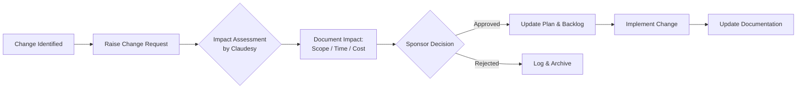

# 01 — PROJECT GOVERNANCE AND ROLES
## Architecture & Built by Claudesy

---

| Field | Value |
|---|---|
| **Project** | Puskesmas Balowerti — Premium Healthcare Web Platform |
| **Document** | 01 — Project Governance and Roles |
| **Version** | 1.0.0 |
| **Author** | dr. Ferdi Iskandar / Claudesy |
| **Date** | 2026-03-03 |
| **Status** | Active |
| **References** | PMBOK 7th Ed. · ISO 21500:2021 |

---

## Table of Contents

1. [Governance Structure](#1-governance-structure)
2. [Roles and Responsibilities](#2-roles-and-responsibilities)
3. [RACI Matrix](#3-raci-matrix)
4. [Stakeholder Register](#4-stakeholder-register)
5. [Decision-Making Authority](#5-decision-making-authority)
6. [Approval and Sign-Off Process](#6-approval-and-sign-off-process)
7. [Change Control Process](#7-change-control-process)
8. [Escalation Path](#8-escalation-path)
9. [Meeting Governance](#9-meeting-governance)
10. [Sign-Off Block](#10-sign-off-block)

---

## 1. Governance Structure

I have established the following governance hierarchy for this project. Each tier has defined authority and accountability:

```
┌─────────────────────────────────────────────────┐
│          PROJECT SPONSOR                         │
│       dr. Ferdi Iskandar                         │
│   (Final Authority — Budget & Clinical)          │
└───────────────────┬─────────────────────────────┘
                    │
                    ▼
┌─────────────────────────────────────────────────┐
│       LEAD DEVELOPER / ARCHITECT                 │
│              Claudesy                            │
│  (Technical Authority — Design & Development)   │
└────────┬──────────────────────┬─────────────────┘
         │                      │
         ▼                      ▼
┌─────────────────┐   ┌────────────────────────────┐
│  QA & Testing   │   │   Content & Clinical Review │
│   (Claudesy)    │   │   (Puskesmas Admin Staff)   │
└─────────────────┘   └────────────────────────────┘
```

**Governance Principle:** I operate under a lean governance model appropriate for a single-vendor engagement. All technical decisions rest with me as Lead Developer; all clinical content and budget decisions rest with dr. Ferdi Iskandar as Project Sponsor.

---

## 2. Roles and Responsibilities

### 2.1 Project Sponsor — dr. Ferdi Iskandar

**I acknowledge the following responsibilities of the Project Sponsor:**

- Provides overall project vision and strategic direction
- Approves project budget and any budget amendments
- Reviews and approves all clinical content (diseases, diagnostic rules, referral criteria)
- Signs off on Phase 1 and Phase 2 acceptance
- Resolves escalated issues that cannot be decided at the developer level
- Represents the project to Dinas Kesehatan Kota Kediri and other government bodies
- Ensures Puskesmas staff availability for UAT and content review

### 2.2 Lead Developer / Architect — Claudesy

**I hold the following responsibilities as Lead Developer:**

- I design, architect, and build the entire platform (frontend, scripts, configuration)
- I maintain the codebase in the GitHub repository
- I manage CI/CD pipelines and Railway deployments
- I produce all project documentation (this dossier)
- I conduct internal QA, performance testing, and accessibility audits
- I integrate third-party APIs (Google Maps, Google Reviews)
- I advise the sponsor on technical feasibility and trade-offs
- I ensure the platform meets all Indonesian regulatory requirements in its technical implementation
- I escalate content or clinical decisions to the Project Sponsor

### 2.3 Puskesmas Administrative Staff (TBD)

- Provides and reviews all content (doctor profiles, service descriptions, facilities)
- Conducts User Acceptance Testing (UAT) for reservation and dashboard features
- Operates the dashboard and report generation tools post-launch
- Reports operational issues to Claudesy via agreed channels

### 2.4 End Users — General Public

- Citizens of Kediri accessing public health information
- Patients making online reservations
- Feedback providers via in-app satisfaction surveys

---

## 3. RACI Matrix

**Legend:** R = Responsible | A = Accountable | C = Consulted | I = Informed

| Activity / Deliverable | dr. Ferdi Iskandar (Sponsor) | Claudesy (Dev) | Puskesmas Staff | Public Users |
|---|:---:|:---:|:---:|:---:|
| Project vision & objectives | A | C | I | — |
| Budget approval | A | I | — | — |
| Technical architecture decisions | C | A/R | — | — |
| UI/UX design | C | A/R | C | — |
| Content creation (text, images) | A | I | R | — |
| Content approval (clinical) | A/R | I | C | — |
| Frontend development | I | A/R | — | — |
| API integration | I | A/R | — | — |
| CI/CD pipeline | I | A/R | — | — |
| Internal QA & testing | C | A/R | — | — |
| User Acceptance Testing (UAT) | A | C | R | — |
| Performance audit | I | A/R | — | — |
| Security audit | I | A/R | — | — |
| Accessibility audit | I | A/R | C | — |
| Regulatory compliance review | A | R | C | — |
| Deployment to production | C | A/R | I | — |
| Phase 1 acceptance sign-off | A | R | C | — |
| Phase 2 acceptance sign-off | A | R | C | — |
| Documentation (this dossier) | C | A/R | I | — |
| Post-launch monitoring | C | A/R | I | — |
| Change request approval | A | R | C | — |
| Maintenance & updates | C | A/R | I | — |
| Incident response | A | R | I | — |

---

## 4. Stakeholder Register

| # | Stakeholder | Role | Organization | Interest Level | Influence Level | Engagement Strategy |
|---|---|---|---|---|---|---|
| S1 | dr. Ferdi Iskandar | Project Sponsor | Puskesmas Balowerti | High | High | Weekly status updates; formal sign-offs |
| S2 | Claudesy | Lead Developer / Architect | Independent | High | High | Daily work; all technical decisions |
| S3 | Puskesmas Admin Staff | Content Provider / UAT | Puskesmas Balowerti | Medium | Medium | Content review sessions; UAT coordination |
| S4 | Clinical Staff (Doctors) | Profile Subjects / Reviewers | Puskesmas Balowerti | Low | Low | Photo & profile approval requests |
| S5 | Dinas Kesehatan Kota Kediri | Regulatory Body | Government | Medium | High | Compliance documentation; formal reporting |
| S6 | Citizens of Kediri | End Users | Public | High | Low | Public survey; analytics monitoring |
| S7 | Railway (Platform) | Infrastructure Provider | Railway Inc. | Low | Medium | Platform SLA monitoring; support tickets |
| S8 | Google (APIs) | API Provider | Google LLC | Low | Medium | API quota monitoring; terms compliance |

---

## 5. Decision-Making Authority

I have defined the following authority tiers to ensure fast, unambiguous decision-making:

| Decision Type | Authority Level | Owner | Turnaround |
|---|---|---|---|
| Technical implementation choice | Level 1 | Claudesy | Immediate |
| UI/UX design changes (minor) | Level 1 | Claudesy | Immediate |
| Content additions / edits | Level 2 | Puskesmas Staff + Sponsor | 2 business days |
| Clinical content or diagnostic rules | Level 2 | dr. Ferdi Iskandar | 2 business days |
| Budget allocation changes | Level 3 | dr. Ferdi Iskandar | 5 business days |
| Scope additions (new features) | Level 3 | dr. Ferdi Iskandar + Claudesy | 5 business days |
| Emergency production fixes | Level 1 | Claudesy (notify sponsor) | Immediate |
| Regulatory / legal decisions | Level 3 | dr. Ferdi Iskandar | 5 business days |

---

## 6. Approval and Sign-Off Process

### 6.1 Phase Acceptance Process

I will request formal sign-off at each project milestone using the following process:

1. **I prepare** — I complete the deliverable and run internal QA checks.
2. **I notify** — I send a delivery notification to the Project Sponsor with a summary and review link.
3. **Review period** — Sponsor and relevant stakeholders review within the agreed window (typically 5 business days).
4. **Feedback loop** — Any required changes are communicated and I address them within the agreed timeline.
5. **Sign-off** — Sponsor signs the acceptance block in this document or on the designated sign-off form.
6. **Archive** — I archive the signed acceptance record in the project repository.

### 6.2 Document Sign-Off Language Template

> "I, [Name], in my capacity as [Role] for the Puskesmas Balowerti Premium Healthcare Web Platform project, hereby confirm that I have reviewed the [Document Name / Deliverable Name] dated [Date] and accept it as meeting the agreed requirements and standards. I authorize progression to the next project phase / milestone."
>
> Signed: _________________ Date: _________________

---

## 7. Change Control Process

I will manage all scope changes through the following formal process:

### 7.1 Change Request Flow



### 7.2 Change Request Template

```
CHANGE REQUEST
Project:      Puskesmas Balowerti Premium Healthcare Web Platform
CR Number:    CR-[NNN]
Date:         YYYY-MM-DD
Requested by: [Name / Role]

Description of Change:
[Clear description of what is being changed and why]

Impact Assessment (completed by Claudesy):
- Scope impact:    [None / Minor / Major]
- Schedule impact: [+/- N days]
- Budget impact:   [+/- IDR N]
- Risk impact:     [None / Low / Medium / High]

Decision:    [ ] Approved   [ ] Rejected   [ ] Deferred
Decision by: [Name]
Date:        YYYY-MM-DD
Notes:       [Any conditions or notes]
```

---

## 8. Escalation Path

I will follow this escalation path when issues cannot be resolved at the immediate level:

| Level | Issue Type | Primary Contact | Escalate To | Timeframe |
|---|---|---|---|---|
| 1 | Technical bugs or blockers | Claudesy (self-resolve) | — | Same day |
| 2 | Content or review delays | Puskesmas Staff | dr. Ferdi Iskandar | 2 days |
| 3 | Budget or scope disputes | dr. Ferdi Iskandar | Mutual agreement session | 5 days |
| 4 | Regulatory/legal issues | dr. Ferdi Iskandar | Dinas Kesehatan / Legal counsel | As required |
| 5 | Platform / infrastructure outage | Railway support | Claudesy + Sponsor notification | Immediate |

---

## 9. Meeting Governance

| Meeting | Frequency | Participants | Format | Objective |
|---|---|---|---|---|
| Technical Standup | Weekly (async or sync) | Claudesy | Async WhatsApp / Email | Progress update, blockers |
| Sponsor Review | Bi-weekly | dr. Ferdi + Claudesy | Video call (Google Meet) | Milestone review, decisions |
| Content Review | As needed | Puskesmas Staff + Claudesy | Video or in-person | Content accuracy sign-off |
| UAT Session | Phase end | All stakeholders | In-person / remote | Acceptance testing |
| Phase Sign-Off | Phase end | dr. Ferdi + Claudesy | Formal meeting + document | Formal acceptance |
| Post-Launch Review | 30 days post-launch | All | Video call | KPI review, lessons learned |

**Meeting minutes** will be recorded by Claudesy and distributed within 24 hours of each meeting.

---

## 10. Sign-Off Block

By signing below, I confirm that I have reviewed and approved the governance structure, roles, RACI matrix, and escalation framework defined in this document.

| Role | Name | Signature | Date |
|---|---|---|---|
| Project Sponsor | dr. Ferdi Iskandar | ___________________ | ___________ |
| Lead Developer / Architect | Claudesy | ___________________ | 2026-03-03 |

---

---
*Prepared by: dr. Ferdi Iskandar / Claudesy — Architecture & Built by Claudesy — Date: 2026-03-03*
