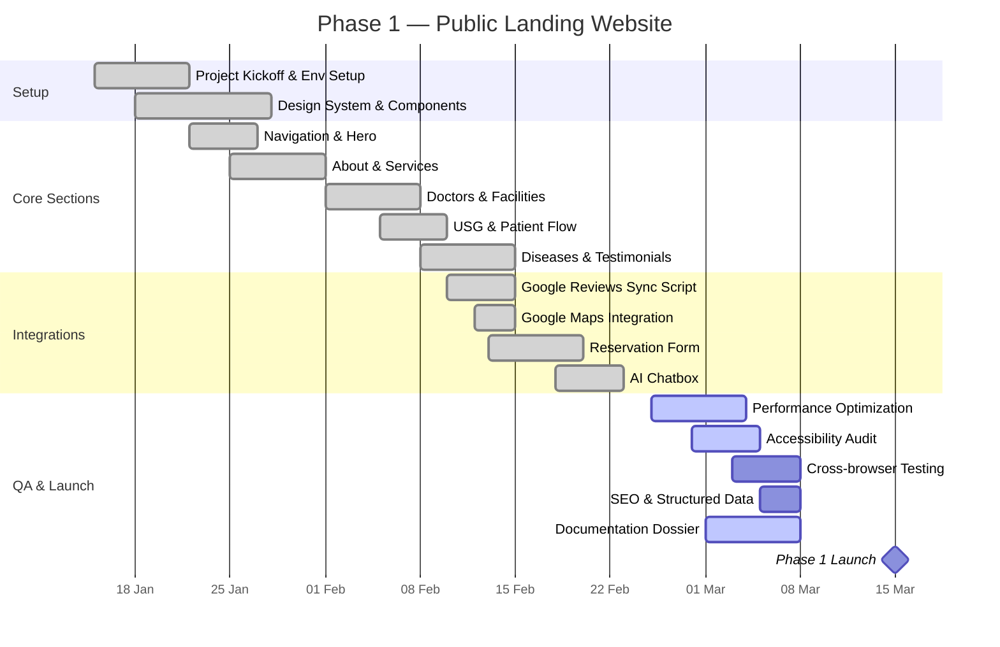
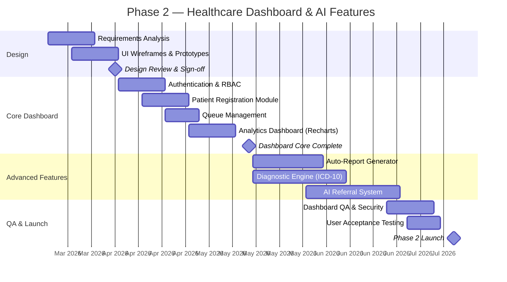

# 02 — PROJECT PLAN AND SCHEDULE
## Architecture & Built by Claudesy

---

| Field | Value |
|---|---|
| **Project** | Puskesmas Balowerti — Premium Healthcare Web Platform |
| **Document** | 02 — Project Plan and Schedule |
| **Version** | 1.0.0 |
| **Author** | dr. Ferdi Iskandar / Claudesy |
| **Date** | 2026-03-03 |
| **Status** | Active |
| **References** | PMBOK 7th Ed. · ISO 21500:2021 |

---

## Table of Contents

1. [Project Phases Overview](#1-project-phases-overview)
2. [Work Breakdown Structure (WBS)](#2-work-breakdown-structure-wbs)
3. [Milestone Schedule](#3-milestone-schedule)
4. [Gantt Chart — Phase 1](#4-gantt-chart--phase-1)
5. [Gantt Chart — Phase 2](#5-gantt-chart--phase-2)
6. [Critical Path Analysis](#6-critical-path-analysis)
7. [Sprint / Iteration Plan](#7-sprint--iteration-plan)
8. [Resource Allocation](#8-resource-allocation)
9. [Schedule Risk Buffer](#9-schedule-risk-buffer)
10. [Sign-Off Block](#10-sign-off-block)

---

## 1. Project Phases Overview

I have structured this project into two major delivery phases with a maintenance phase following:

| Phase | Name | Duration | Status | Target Date |
|---|---|---|---|---|
| Phase 0 | Project Setup & Documentation | 2 weeks | Complete | 2026-01-22 |
| Phase 1 | Public Landing Website | 8 weeks | In Progress | 2026-03-15 |
| Phase 2 | Healthcare Dashboard & AI Features | 16 weeks | Planned | 2026-07-15 |
| Phase 3 | Stabilization & Handover | 4 weeks | Planned | 2026-08-15 |
| Ongoing | Maintenance & Operations | Continuous | Planned | Post-launch |

---

## 2. Work Breakdown Structure (WBS)

```
1.0 Puskesmas Balowerti Platform
│
├── 1.1 Project Management
│   ├── 1.1.1 Project initiation & kickoff
│   ├── 1.1.2 Documentation dossier
│   ├── 1.1.3 Status reporting
│   └── 1.1.4 Phase reviews & sign-offs
│
├── 1.2 Phase 1 — Public Landing Website
│   ├── 1.2.1 Environment setup (Vite + React + Tailwind)
│   ├── 1.2.2 Design system (Radix UI + shadcn/ui components)
│   ├── 1.2.3 Navigation & routing
│   ├── 1.2.4 Hero section (Framer Motion animation)
│   ├── 1.2.5 About section
│   ├── 1.2.6 Services section
│   ├── 1.2.7 Doctors section
│   ├── 1.2.8 Facilities section
│   ├── 1.2.9 USG highlight section
│   ├── 1.2.10 Patient flow visualization
│   ├── 1.2.11 Diseases information section
│   ├── 1.2.12 Testimonials + Google Reviews integration
│   ├── 1.2.13 Reservation / appointment booking form
│   ├── 1.2.14 Location + Google Maps integration
│   ├── 1.2.15 Footer
│   ├── 1.2.16 AI Chatbox (LuxuryChatbox component)
│   ├── 1.2.17 Story scroll feature
│   ├── 1.2.18 Performance optimization (images, fonts, LCP)
│   ├── 1.2.19 SEO metadata & structured data
│   ├── 1.2.20 Accessibility audit & fixes (WCAG 2.2 AA)
│   ├── 1.2.21 QA & cross-browser testing
│   └── 1.2.22 Railway deployment & DNS configuration
│
├── 1.3 Phase 2 — Healthcare Dashboard
│   ├── 1.3.1 Requirements analysis & UI wireframes
│   ├── 1.3.2 Authentication system (RBAC)
│   ├── 1.3.3 Patient registration & queue module
│   ├── 1.3.4 Analytics dashboard (Recharts)
│   ├── 1.3.5 Auto-report generator (PDF/XLSX)
│   ├── 1.3.6 Diagnostic engine (ICD-10 integration)
│   ├── 1.3.7 AI referral recommendation system
│   ├── 1.3.8 Dashboard QA & UAT
│   └── 1.3.9 Phase 2 deployment
│
└── 1.4 Infrastructure & DevOps
    ├── 1.4.1 GitHub repository management
    ├── 1.4.2 CI/CD pipeline (GitHub Actions)
    ├── 1.4.3 Railway configuration
    ├── 1.4.4 Environment management
    ├── 1.4.5 Monitoring & alerting setup
    └── 1.4.6 Security scanning
```

---

## 3. Milestone Schedule

| # | Milestone | Target Date | Status | Acceptance Criteria |
|---|---|---|---|---|
| M0 | Project Kickoff | 2026-01-15 | Complete | Sponsor sign-off on scope |
| M1 | Dev Environment Ready | 2026-01-22 | Complete | Vite + Railway running |
| M2 | Core Sections Complete | 2026-02-15 | Complete | Hero, About, Services, Doctors live |
| M3 | All Sections + Integrations | 2026-02-28 | Complete | Google Reviews + Maps live |
| M4 | Phase 1 QA Pass | 2026-03-10 | In Progress | Lighthouse ≥ 90, 0 critical bugs |
| M5 | **Phase 1 Production Launch** | **2026-03-15** | **Target** | Sponsor sign-off, site live |
| M6 | Phase 2 Design Approved | 2026-04-05 | Planned | Wireframes signed off |
| M7 | Dashboard Core Live | 2026-05-15 | Planned | Auth + analytics working |
| M8 | Diagnostic Engine Live | 2026-06-15 | Planned | ICD-10 integration complete |
| M9 | AI Referral System Live | 2026-06-30 | Planned | Referral recommendations working |
| M10 | Phase 2 UAT Complete | 2026-07-10 | Planned | UAT sign-off by sponsor |
| M11 | **Phase 2 Production Launch** | **2026-07-15** | **Planned** | Full platform live |
| M12 | Handover Complete | 2026-08-15 | Planned | Handover docs + training done |

---

## 4. Gantt Chart — Phase 1



---

## 5. Gantt Chart — Phase 2



---

## 6. Critical Path Analysis

The critical path represents the sequence of dependent tasks that determines the minimum project duration. I have identified the following critical path for Phase 1:

```
Environment Setup
      ↓
Design System & Component Library
      ↓
Navigation + Hero + Core Sections
      ↓
API Integrations (Google Reviews + Maps)
      ↓
Performance Optimization + Accessibility Audit
      ↓
Cross-Browser QA
      ↓
[MILESTONE] Phase 1 Production Launch
```

**Critical Path for Phase 2:**

```
Phase 1 Launch
      ↓
Requirements Analysis + Wireframes
      ↓
Authentication / RBAC System
      ↓
Diagnostic Engine (longest duration: 28 days)
      ↓
AI Referral System (depends on Diagnostic Engine)
      ↓
UAT
      ↓
[MILESTONE] Phase 2 Production Launch
```

**Float Analysis:**
- Auto-Report Generator: +7 days float (can slip up to 7 days without affecting launch)
- Analytics Dashboard: +14 days float
- Patient Registration Module: +0 days float (on critical path)

---

## 7. Sprint / Iteration Plan

I organize development work into 2-week sprints:

| Sprint | Dates | Focus | Key Deliverables |
|---|---|---|---|
| Sprint 0 | Jan 15–22 | Setup & Foundation | Vite + Railway + component library |
| Sprint 1 | Jan 22 – Feb 5 | Core Sections | Hero, About, Services, Doctors |
| Sprint 2 | Feb 5–19 | Content Sections | Facilities, USG, Patient Flow, Diseases |
| Sprint 3 | Feb 19 – Mar 5 | Integrations | Google Reviews, Maps, Reservation, Chatbox |
| Sprint 4 | Mar 5–15 | QA & Launch | Testing, optimization, docs, Phase 1 launch |
| Sprint 5 | Mar 16 – Apr 5 | Phase 2 Design | Requirements, wireframes, architecture |
| Sprint 6–7 | Apr 6–May 5 | Dashboard Core | Auth, patient module, queue, analytics |
| Sprint 8–9 | May 5–Jun 15 | Advanced Features | Reports, Diagnostic Engine |
| Sprint 10–11 | Jun 15–Jul 15 | AI + QA + Launch | AI Referral, UAT, Phase 2 launch |

---

## 8. Resource Allocation

| Resource | Role | Allocation | Phase 1 | Phase 2 |
|---|---|---|---|---|
| Claudesy | Lead Developer / Architect | 100% | Full | Full |
| dr. Ferdi Iskandar | Project Sponsor | ~5% | Reviews + approvals | Reviews + approvals |
| Puskesmas Admin Staff | Content + UAT | ~10% | Content review | UAT sessions |
| Railway (Platform) | Infrastructure | N/A | Deployment | Deployment |
| Google APIs | External service | N/A | Maps + Reviews | Maps + Reviews |

---

## 9. Schedule Risk Buffer

I have incorporated the following buffers to manage schedule risk:

| Phase | Planned Duration | Buffer | Total with Buffer |
|---|---|---|---|
| Phase 1 | 7 weeks | 1 week | 8 weeks |
| Phase 2 | 14 weeks | 2 weeks | 16 weeks |
| Phase 3 (Handover) | 3 weeks | 1 week | 4 weeks |

**Buffer Management Rules:**
1. I will not use buffer time for scope additions.
2. I will consume buffer only when a critical-path task is delayed.
3. I will notify the Project Sponsor immediately if more than 50% of a phase buffer is consumed.
4. If buffer is fully consumed, I will initiate a formal scope/timeline review with the sponsor.

---

## 10. Sign-Off Block

By signing below, I confirm that I have reviewed and approved the project plan and schedule defined in this document.

| Role | Name | Signature | Date |
|---|---|---|---|
| Project Sponsor | dr. Ferdi Iskandar | ___________________ | ___________ |
| Lead Developer / Architect | Claudesy | ___________________ | 2026-03-03 |

---

---
*Prepared by: dr. Ferdi Iskandar / Claudesy — Architecture & Built by Claudesy — Date: 2026-03-03*
