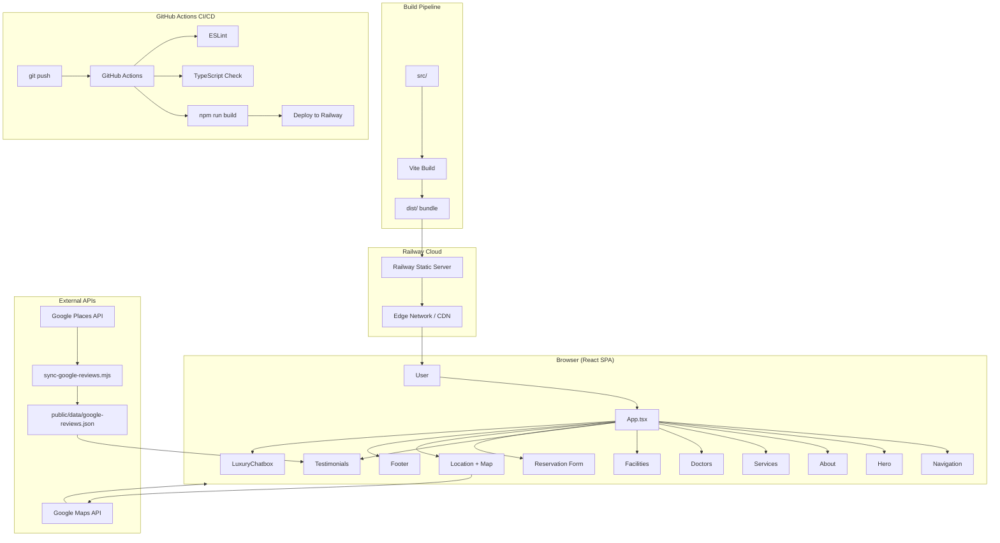
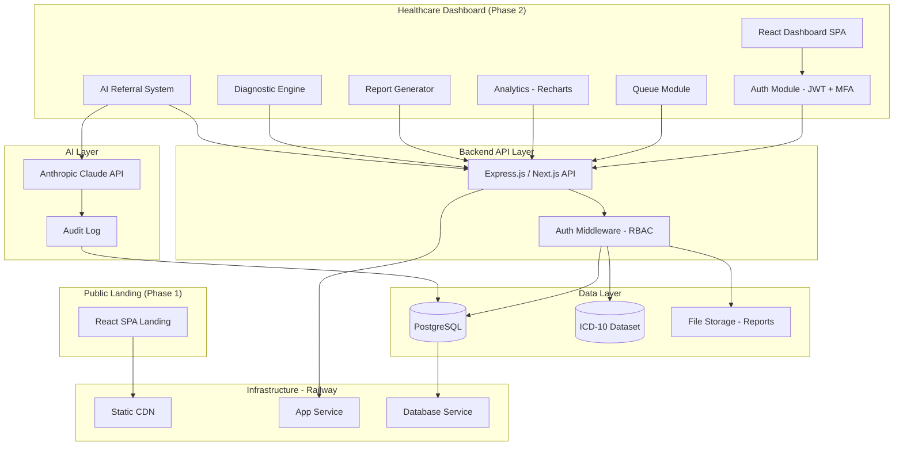
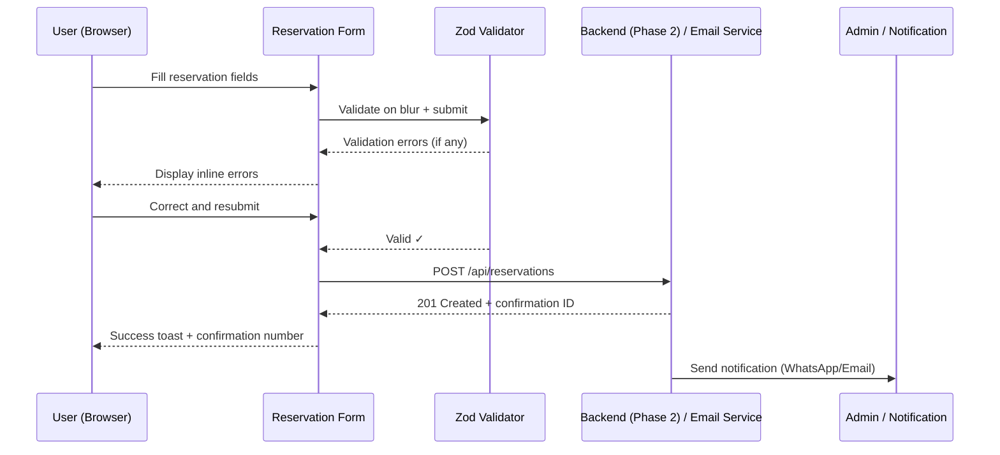
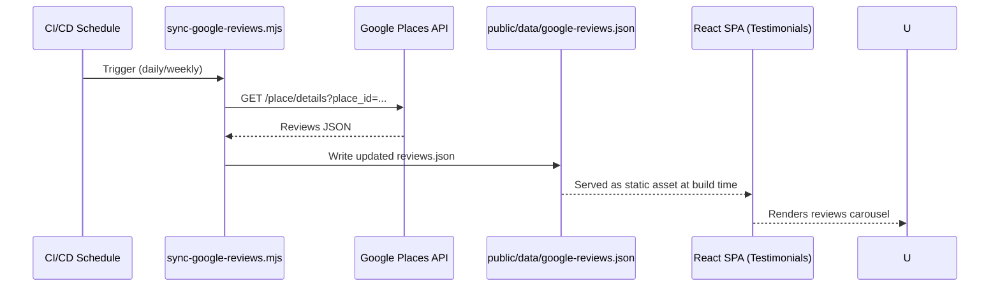
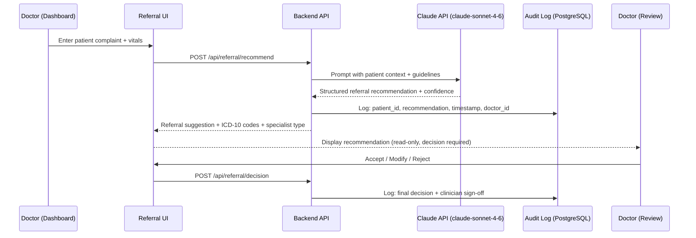
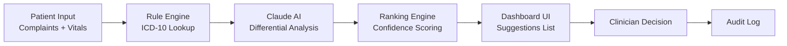

# 06 — TECHNICAL ARCHITECTURE DOCUMENT
## Architecture & Built by Claudesy

---

| Field | Value |
|---|---|
| **Project** | Puskesmas Balowerti — Premium Healthcare Web Platform |
| **Document** | 06 — Technical Architecture Document |
| **Version** | 1.0.0 |
| **Author** | dr. Ferdi Iskandar / Claudesy |
| **Date** | 2026-03-03 |
| **Status** | Active |
| **References** | ISO/IEC/IEEE 42010:2022 · React 19 · Vite 7 · Railway |

---

## Table of Contents

1. [Architecture Overview](#1-architecture-overview)
2. [Technology Stack](#2-technology-stack)
3. [System Architecture Diagram](#3-system-architecture-diagram)
4. [Component Architecture](#4-component-architecture)
5. [Data Flow & Sequence Diagrams](#5-data-flow--sequence-diagrams)
6. [Infrastructure Architecture](#6-infrastructure-architecture)
7. [Security Architecture](#7-security-architecture)
8. [Performance Architecture](#8-performance-architecture)
9. [Non-Functional Requirements](#9-non-functional-requirements)
10. [API & Integration Architecture](#10-api--integration-architecture)
11. [Phase 2 — Future Architecture (Dashboard + AI)](#11-phase-2--future-architecture-dashboard--ai)
12. [Architecture Decision Records (ADRs)](#12-architecture-decision-records-adrs)
13. [Sign-Off Block](#13-sign-off-block)

---

## 1. Architecture Overview

I have designed the Puskesmas Balowerti platform as a **modern, component-based Single Page Application (SPA)** for Phase 1, with a clear evolution path toward a **full-stack healthcare management platform** in Phase 2.

**Key Architectural Principles I applied:**
1. **Component-First Design** — I built using atomic, composable React components via Radix UI primitives.
2. **Performance by Default** — Vite's build-time optimizations, lazy loading, and image processing deliver sub-2.5s LCP.
3. **Accessibility as Architecture** — WCAG 2.2 AA is a first-class architectural requirement, not an afterthought.
4. **Separation of Concerns** — UI components, section orchestration, hooks, and utilities are cleanly separated.
5. **Progressive Enhancement** — Phase 2 dashboard features are addable without disrupting Phase 1 landing site.
6. **Security by Design** — No patient data processed client-side without explicit encryption and compliance review.

---

## 2. Technology Stack

### 2.1 Frontend (Phase 1 — Current)

| Layer | Technology | Version | Purpose |
|---|---|---|---|
| Framework | React | 19.x | UI component rendering |
| Language | TypeScript | ~5.9 | Type safety, developer experience |
| Build Tool | Vite | 7.x | Development server + production bundler |
| Styling | Tailwind CSS | 3.4.x | Utility-first CSS framework |
| Animation | Framer Motion | 12.x | Smooth, GPU-accelerated animations |
| Smooth Scroll | Lenis | 1.3.x | Native-feel smooth scrolling |
| Component Library | Radix UI + shadcn/ui | Latest | Accessible, unstyled primitives |
| Icons | Lucide React | 0.562.x | Consistent icon set |
| Forms | React Hook Form | 7.x | Performant form state management |
| Validation | Zod | 4.x | Schema-based input validation |
| Charts | Recharts | 2.x | React-native charting (Phase 2 ready) |
| Date Utilities | date-fns | 4.x | Date formatting and manipulation |
| Toast Notifications | Sonner | 2.x | Non-intrusive notifications |
| Theme | next-themes | 0.4.x | Dark/light mode support |

### 2.2 Infrastructure (Phase 1 — Current)

| Layer | Technology | Purpose |
|---|---|---|
| Hosting | Railway | Cloud PaaS deployment |
| CDN | Railway Edge Network | Global asset delivery |
| CI/CD | GitHub Actions | Automated build + deploy pipeline |
| Version Control | GitHub | Source code repository |
| Process Manager | Railway | Auto-restart, health checks |

### 2.3 External Integrations (Phase 1)

| Service | Provider | Purpose |
|---|---|---|
| Maps | Google Maps Platform | Location display |
| Reviews | Google Places API | Auto-synced testimonials |
| Analytics | Google Analytics 4 (planned) | Traffic and behavior analytics |

### 2.4 Planned Stack Additions (Phase 2)

| Layer | Technology | Purpose |
|---|---|---|
| Backend API | Node.js + Express or Next.js API Routes | Server-side logic |
| Database | PostgreSQL (Railway-hosted) | Patient records, reservations, reports |
| ORM | Drizzle ORM | Type-safe database queries |
| Authentication | JWT + Refresh Tokens + MFA | Secure staff authentication |
| File Storage | Railway Volumes / S3-compatible | Report files, images |
| AI/LLM | Anthropic Claude API (claude-sonnet-4-6) | Diagnostic + referral AI |
| Report Generation | Puppeteer or react-pdf | Auto PDF/XLSX report export |
| ICD-10 | WHO ICD-10 API or local dataset | Diagnostic code mapping |

---

## 3. System Architecture Diagram

### 3.1 Phase 1 — Current Architecture



### 3.2 Phase 2 — Target Architecture



---

## 4. Component Architecture

### 4.1 Component Hierarchy

```
App.tsx
├── Navigation (sticky, animated)
├── Hero (Framer Motion, LCP-critical)
├── About
├── Services (accordion/cards)
├── Doctors (profile cards + schedule)
├── Facilities (image gallery)
├── USG (highlighted service)
├── PatientFlow (visual journey)
├── Diseases (ICD preview, public education)
├── Testimonials (Google Reviews carousel)
├── Reservation (React Hook Form + Zod)
├── Location (Google Maps embed)
├── Footer
├── LuxuryChatbox (AI-powered, floating)
└── StoryScroll (narrative scroll experience)
```

### 4.2 Shared Component Library (src/components/)

I have adopted **shadcn/ui** as the component foundation — Radix UI primitives with Tailwind CSS styling. Key components:

| Component | Source | Usage |
|---|---|---|
| Button | shadcn/ui | CTAs, form submits |
| Dialog | Radix UI | Modals |
| Accordion | Radix UI | FAQ, services |
| Card | shadcn/ui | Doctor profiles, services |
| Form + Input | React Hook Form + shadcn/ui | Reservation form |
| Select, DatePicker | shadcn/ui | Form fields |
| Carousel | Embla Carousel | Testimonials |
| Tabs | Radix UI | Dashboard tabs (Phase 2) |
| Chart | Recharts | Analytics (Phase 2) |
| Toast | Sonner | Notifications |

### 4.3 Custom Hooks

| Hook | File | Purpose |
|---|---|---|
| `useMobile` | `src/hooks/use-mobile.ts` | Detect mobile viewport |
| `useSmoothImage` | `src/hooks/useSmoothImage.ts` | Smooth image loading transitions |

---

## 5. Data Flow & Sequence Diagrams

### 5.1 Reservation Form Submission Flow



### 5.2 Google Reviews Sync Flow



### 5.3 Phase 2 — AI Referral System Flow



---

## 6. Infrastructure Architecture

### 6.1 Railway Deployment Configuration

I deploy the application to Railway using the following configuration (`railway.toml`):

```toml
[build]
builder = "nixpacks"
buildCommand = "npm run build"

[deploy]
startCommand = "npx serve dist --single --listen $PORT"
healthcheckPath = "/"
healthcheckTimeout = 30
restartPolicyType = "on-failure"
restartPolicyMaxRetries = 3
```

### 6.2 Build Pipeline Flow

```
git push origin main
      ↓
GitHub Actions triggered
      ↓
┌─────────────────────┐
│ 1. npm ci           │  Install dependencies
│ 2. npx tsc --noEmit │  TypeScript check
│ 3. npm run lint     │  ESLint check
│ 4. npm run build    │  Vite production build
└─────────────────────┘
      ↓
Railway receives build artifact
      ↓
Railway deploys dist/ with static server
      ↓
Health check passes → Traffic switches
      ↓
Previous deployment retained for rollback
```

### 6.3 Environment Architecture

| Environment | Purpose | Deployment | URL |
|---|---|---|---|
| Development | Local developer server | `npm run dev` | localhost:5173 |
| Preview | Branch-based preview (PR review) | Railway Preview | auto-generated URL |
| Production | Live public site | Railway Production | Custom domain |

---

## 7. Security Architecture

### 7.1 Security Layers

| Layer | Control | Implementation |
|---|---|---|
| Transport | TLS/HTTPS | Railway automatic SSL (Let's Encrypt) |
| HTTP Headers | Security headers | CSP, X-Frame-Options, HSTS, X-Content-Type |
| Input Validation | Schema validation | Zod on all form inputs |
| XSS Prevention | Content sanitization | React's JSX escaping + DOMPurify where needed |
| CSRF | Token-based | Phase 2 API layer |
| Authentication | JWT + MFA | Phase 2 dashboard |
| Authorization | RBAC | Phase 2 dashboard |
| Data at Rest | Encryption | PostgreSQL encryption (Phase 2) |
| Data in Transit | HTTPS | TLS 1.3 |
| Audit Logging | Complete trail | All AI recommendations + admin actions (Phase 2) |
| Dependency Security | Automated scanning | npm audit in CI |

### 7.2 Data Classification

| Data Type | Classification | Stored | Encryption | Compliance |
|---|---|---|---|---|
| Public health content | Public | Static JSON / CMS | None required | N/A |
| Reservation name + phone | Personal Data | Phase 2 DB | Required | UU PDP 27/2022 |
| Patient medical history | Sensitive Personal Data | Phase 2 DB | Required + Access Control | UU PDP + Permenkes |
| Doctor profiles | Public | Static JSON | None | N/A |
| AI referral logs | Sensitive Personal Data | Phase 2 DB | Required | UU PDP + Clinical |
| API Keys (Google, AI) | Secret | Railway Env Vars | Platform-managed | N/A |

---

## 8. Performance Architecture

### 8.1 Build Optimization (Vite)

I configure Vite for optimal production performance:

```typescript
// vite.config.ts (excerpt)
export default defineConfig({
  build: {
    target: 'es2020',
    rollupOptions: {
      output: {
        manualChunks: {
          vendor: ['react', 'react-dom'],
          ui: ['@radix-ui/react-dialog', '@radix-ui/react-tabs'],
          motion: ['framer-motion'],
          charts: ['recharts'],
        }
      }
    }
  },
  plugins: [react()],
})
```

### 8.2 Image Optimization Pipeline

I use the `sharp` library (devDependency) in build scripts to:
- Convert JPEG/PNG → WebP/AVIF
- Resize to maximum display dimensions
- Strip EXIF metadata
- Apply progressive loading

### 8.3 Performance Budget

| Asset Type | Budget | Current |
|---|---|---|
| Total JS (gzipped) | < 500KB | To measure |
| Total CSS (gzipped) | < 100KB | To measure |
| Hero image | < 200KB | To verify |
| Doctor photo (each) | < 50KB | To verify |
| Total page weight | < 2MB | To measure |
| Time to Interactive | < 3.5s (4G mobile) | To measure |

---

## 9. Non-Functional Requirements

| NFR | Requirement | Target | Priority |
|---|---|---|---|
| Performance | Page load speed | LCP < 2.5s (desktop), < 4s (3G mobile) | Critical |
| Availability | Uptime SLA | ≥ 99.5% | Critical |
| Scalability | Concurrent users | Handle 500 concurrent users (Phase 1) | High |
| Security | Vulnerability posture | OWASP Top 10 compliant | Critical |
| Accessibility | WCAG compliance | Level AA (2.2) | Critical |
| Maintainability | Code quality | TypeScript strict, ESLint clean | High |
| Internalization | Language support | Indonesian primary, English secondary | Medium |
| Browser Support | Compatibility | Evergreen browsers (Chrome, Safari, Firefox, Edge) | High |
| Data Privacy | PDP Law compliance | UU No. 27/2022 compliant | Critical |
| Observability | Monitoring | Error tracking + performance monitoring | High |
| Sustainability | Energy efficiency | Minimal JavaScript, optimized assets | Medium |

---

## 10. API & Integration Architecture

### 10.1 Google Maps Integration

```
src/sections/Location.tsx
│
└── <iframe> embed OR Maps JavaScript API
    ├── API Key: GOOGLE_MAPS_API_KEY (env var)
    ├── Place: Puskesmas Balowerti Kediri
    └── Restrictions: HTTP referrer restricted to production domain
```

### 10.2 Google Reviews Integration

```
scripts/sync-google-reviews.mjs
│
├── Input: GOOGLE_PLACE_QUERY env var
├── API Call: Google Places Details API
├── Output: public/data/google-reviews.json
└── Schedule: Manual or CI/CD cron (weekly)

src/sections/Testimonials.tsx
└── import reviews from '../data/google-reviews.json'
    └── Rendered in Embla Carousel
```

### 10.3 Phase 2 — Internal API Design

```
REST API (Express.js)
│
├── POST /api/auth/login
├── POST /api/auth/refresh
├── POST /api/auth/logout
│
├── GET  /api/reservations
├── POST /api/reservations
├── PUT  /api/reservations/:id
│
├── GET  /api/patients
├── POST /api/patients
│
├── POST /api/diagnostic/suggest
├── GET  /api/diagnostic/icd10/search
│
├── POST /api/referral/recommend  ← AI-powered
├── POST /api/referral/decision
│
├── GET  /api/reports/monthly
├── POST /api/reports/generate   ← triggers PDF/XLSX
│
└── GET  /api/analytics/dashboard
```

---

## 11. Phase 2 — Future Architecture (Dashboard + AI)

### 11.1 Diagnostic Engine Architecture



### 11.2 Report Generator Architecture

- **Input:** Date range + report type selection (monthly, quarterly, custom)
- **Processing:** Query PostgreSQL → aggregate data → populate report template
- **Output Formats:** PDF (via Puppeteer headless Chrome) | XLSX (via exceljs)
- **Storage:** Railway Volume or S3-compatible
- **Delivery:** Download link or email attachment

---

## 12. Architecture Decision Records (ADRs)

### ADR-001: React SPA over Next.js

**Decision:** I chose React + Vite (SPA) over Next.js for Phase 1.
**Rationale:** Phase 1 is a purely static marketing site; SSR is unnecessary overhead. Vite offers significantly faster DX. Phase 2 may revisit this.
**Trade-offs:** No SSR; SEO relies on proper meta tags + React Helmet equivalent.
**Status:** Accepted.

### ADR-002: Railway over Vercel

**Decision:** I chose Railway as the deployment platform.
**Rationale:** Railway provides both static hosting and future PostgreSQL database in a single platform, simplifying Phase 2 infrastructure. Vercel would require additional DB service.
**Trade-offs:** Less generous free tier; fewer edge locations than Vercel.
**Status:** Accepted.

### ADR-003: Tailwind CSS + Radix UI over full UI kit

**Decision:** I chose Tailwind CSS + Radix UI primitives (via shadcn/ui) over a full UI kit (e.g., MUI, Ant Design).
**Rationale:** Maximum design flexibility for premium custom aesthetics; zero imposed visual style; full accessibility from Radix primitives.
**Trade-offs:** More initial component setup; larger CSS output (mitigated by Tailwind purging).
**Status:** Accepted.

### ADR-004: Zod for validation

**Decision:** I use Zod v4 for both form validation and (future) API schema validation.
**Rationale:** TypeScript-native, composable, works with React Hook Form resolver. Single validation library for frontend and backend.
**Status:** Accepted.

### ADR-005: Anthropic Claude API for AI features

**Decision:** I will use Anthropic Claude (claude-sonnet-4-6) for Phase 2 AI features.
**Rationale:** Best-in-class instruction-following for clinical-adjacent text; strong safety guardrails important for healthcare context; structured output support for diagnostic codes.
**Status:** Planned (Phase 2).

---

## 13. Sign-Off Block

By signing below, I confirm that I have reviewed and approved the Technical Architecture Document.

| Role | Name | Signature | Date |
|---|---|---|---|
| Project Sponsor | dr. Ferdi Iskandar | ___________________ | ___________ |
| Lead Developer / Architect | Claudesy | ___________________ | 2026-03-03 |

---

---
*Prepared by: dr. Ferdi Iskandar / Claudesy — Architecture & Built by Claudesy — Date: 2026-03-03*
