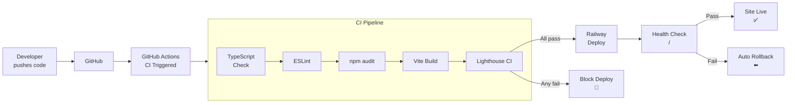
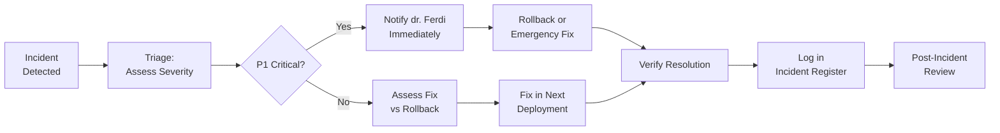

# 10 — DEPLOYMENT AND OPERATIONS PLAN
## Architecture & Built by Claudesy

---

| Field | Value |
|---|---|
| **Project** | Puskesmas Balowerti — Premium Healthcare Web Platform |
| **Document** | 10 — Deployment and Operations Plan |
| **Version** | 1.0.0 |
| **Author** | dr. Ferdi Iskandar / Claudesy |
| **Date** | 2026-03-03 |
| **Status** | Active |
| **References** | Railway Docs · GitHub Actions · OWASP Deployment Guide |

---

## Table of Contents

1. [Deployment Overview](#1-deployment-overview)
2. [Environments](#2-environments)
3. [Deployment Pipeline](#3-deployment-pipeline)
4. [Pre-Deployment Checklist](#4-pre-deployment-checklist)
5. [Deployment Procedures](#5-deployment-procedures)
6. [Rollback Plan](#6-rollback-plan)
7. [Post-Deployment Verification](#7-post-deployment-verification)
8. [Monitoring and Observability](#8-monitoring-and-observability)
9. [Incident Response](#9-incident-response)
10. [Maintenance Windows](#10-maintenance-windows)
11. [Operational Runbooks](#11-operational-runbooks)
12. [Sign-Off Block](#12-sign-off-block)

---

## 1. Deployment Overview

I deploy the Puskesmas Balowerti platform using a **continuous deployment** model via Railway, triggered by pushes to the `master` branch in the GitHub repository.

**Deployment Model:** Git-push → GitHub Actions CI → Railway auto-deploy
**Current Platform:** Railway (PaaS)
**Build Tool:** Vite (production build to `dist/`)
**Serve Method:** Railway static server (serves `dist/` with SPA routing)
**SSL/TLS:** Automatic via Railway (Let's Encrypt)

---

## 2. Environments

| Environment | Branch | URL | Purpose | Deploy Trigger |
|---|---|---|---|---|
| **Development** | Any (local) | http://localhost:5173 | Local development with hot reload | `npm run dev` |
| **Preview** | Feature branches | Auto-generated Railway URL | PR review and testing | Push to any branch |
| **Staging** | `staging` | staging.puskesmasbalowerti.id | Pre-production verification | Push to `staging` |
| **Production** | `master` | puskesmasbalowerti.id | Live public site | Push to `master` |

---

## 3. Deployment Pipeline



---

## 4. Pre-Deployment Checklist

### 4.1 Phase 1 Production Launch Checklist

I will complete all items below before authorizing the first production deployment:

**Code Quality:**
- [ ] TypeScript strict mode: 0 errors (`npx tsc --noEmit`)
- [ ] ESLint: 0 errors (`npm run lint`)
- [ ] npm audit: 0 critical, 0 high (`npm audit --audit-level=high`)
- [ ] All planned sections implemented and reviewed

**Performance:**
- [ ] Lighthouse Performance ≥ 90 (desktop)
- [ ] Lighthouse Performance ≥ 80 (mobile simulation)
- [ ] LCP < 2.5s on desktop 4G
- [ ] CLS < 0.1
- [ ] All images optimized (WebP, appropriately sized)
- [ ] Bundle size < 500KB gzipped JS

**Accessibility:**
- [ ] Lighthouse Accessibility ≥ 95
- [ ] axe-core: 0 critical violations
- [ ] Manual keyboard navigation tested
- [ ] Color contrast verified (WCAG 1.4.3)
- [ ] All images have `alt` text

**Security:**
- [ ] OWASP ZAP baseline scan: 0 FAIL items
- [ ] HTTP security headers configured (CSP, HSTS, X-Frame-Options)
- [ ] No API keys or secrets in source code
- [ ] No sensitive data in `console.log`

**Content:**
- [ ] All content reviewed and approved by dr. Ferdi Iskandar
- [ ] Doctor profiles accurate and up-to-date
- [ ] Service information verified
- [ ] Contact details correct
- [ ] Privacy notice published

**SEO & Discoverability:**
- [ ] `<title>` and `<meta description>` set
- [ ] Open Graph tags configured
- [ ] `robots.txt` present and correct
- [ ] `sitemap.xml` present
- [ ] Structured data (Schema.org) implemented

**Infrastructure:**
- [ ] Custom domain configured in Railway
- [ ] DNS records set and propagated
- [ ] HTTPS working with valid certificate
- [ ] Environment variables set in Railway dashboard (API keys)
- [ ] Google Maps API key restricted to production domain

**Final Approval:**
- [ ] UAT sign-off received from dr. Ferdi Iskandar
- [ ] Phase 1 acceptance form signed (see Doc 05 §9.3)

---

## 5. Deployment Procedures

### 5.1 Standard Deployment (Automatic)

I deploy to production by merging to `master`. The pipeline handles the rest:

```bash
# 1. Ensure all QA checks pass locally
npm run build
npm run lint
npx tsc --noEmit

# 2. Merge feature branch to master
git checkout master
git merge feature/my-feature
git push origin master

# → GitHub Actions triggers automatically
# → CI pipeline runs (TypeScript + ESLint + Build + Lighthouse)
# → On success: Railway deploys automatically
# → Monitor deployment at: Railway dashboard
```

### 5.2 Manual Deployment (Emergency)

If the CI/CD pipeline is unavailable:

```bash
# Install Railway CLI (if not installed)
npm install -g @railway/cli

# Authenticate
railway login

# Deploy current directory
railway up

# Or deploy with explicit service
railway up --service puskesmas-frontend
```

### 5.3 Domain Configuration

```bash
# Set custom domain in Railway dashboard, then update DNS:
# CNAME record: puskesmasbalowerti.id → [railway-generated-domain].railway.app
# Or A record: @ → [Railway IP]

# Verify DNS propagation (allow up to 48 hours)
nslookup puskesmasbalowerti.id
dig puskesmasbalowerti.id
```

### 5.4 Environment Variables in Railway

I configure all environment variables in the Railway dashboard (not committed to git):

```
Railway Dashboard → Project → Variables:
  GOOGLE_MAPS_API_KEY = [actual key]
  GOOGLE_PLACE_QUERY  = Puskesmas Balowerti Kediri
  NODE_ENV            = production
```

---

## 6. Rollback Plan

### 6.1 Automatic Rollback

Railway retains the previous deployment. If the health check fails on a new deployment, Railway automatically reverts to the last successful deployment.

### 6.2 Manual Rollback Procedure

If a deployment causes issues after passing the health check:

```bash
# Option 1: Railway Dashboard (fastest)
# Go to Railway Dashboard → Deployments → Select previous → Redeploy

# Option 2: Git revert
git revert HEAD --no-edit
git push origin master
# This triggers a new deployment with the reverted code

# Option 3: Railway CLI
railway rollback
```

### 6.3 Rollback Decision Matrix

| Scenario | Severity | Action | Timeframe |
|---|---|---|---|
| Site completely down (500, blank) | Critical | Rollback immediately | < 15 minutes |
| Major feature broken (reservation form) | High | Rollback within 1 hour | < 1 hour |
| Minor visual issue on one browser | Low | Fix forward in next release | Next sprint |
| Performance degradation > 20% | Medium | Investigate; rollback if unfixable | < 4 hours |
| Security vulnerability discovered | Critical | Rollback + patch immediately | < 30 minutes |

### 6.4 Communication on Rollback

When I initiate a rollback, I will:
1. Immediately notify dr. Ferdi Iskandar via WhatsApp/phone.
2. Document the issue and rollback action in the incident log.
3. Provide an ETA for the permanent fix.
4. Post a brief status update if the downtime exceeds 30 minutes.

---

## 7. Post-Deployment Verification

After every production deployment, I run the following verification checks:

### 7.1 Smoke Test Checklist (5-minute check)

- [ ] Site loads at production URL
- [ ] All navigation links scroll correctly
- [ ] Hero image loads (no broken image)
- [ ] Google Maps renders
- [ ] Google Reviews visible
- [ ] Reservation form renders
- [ ] Mobile menu opens on mobile viewport
- [ ] Console: no JavaScript errors
- [ ] HTTPS active (green padlock)

### 7.2 Automated Post-Deploy Check

```bash
# Quick health check script
curl -f https://puskesmasbalowerti.id/ -o /dev/null -s -w "%{http_code}\n"
# Expected: 200

# Check response headers
curl -I https://puskesmasbalowerti.id/
# Verify: X-Frame-Options, Content-Security-Policy, Strict-Transport-Security
```

---

## 8. Monitoring and Observability

### 8.1 Uptime Monitoring

| Tool | Configuration | Alert Threshold | Alert Channel |
|---|---|---|---|
| Railway Built-in | Health check on `/` | > 1 minute down | Email to Claudesy |
| UptimeRobot (free) | HTTP check every 5 min | 2 consecutive failures | WhatsApp / Email |
| Google Analytics 4 | Real User Monitoring | Significant traffic drop | Email weekly report |

### 8.2 Core Web Vitals Monitoring

I configure Google Search Console to monitor Core Web Vitals in production:
- LCP trends over time
- CLS alerts when threshold exceeded
- INP monitoring

### 8.3 Error Monitoring (Planned)

For Phase 2, I will integrate an error monitoring service:
- **Sentry** (free tier): JavaScript runtime error capture
- Configuration: Source maps uploaded at build time for meaningful stack traces

### 8.4 Lighthouse Monitoring (Automated)

Lighthouse CI runs on every PR and master push, providing performance trend tracking over time.

---

## 9. Incident Response

### 9.1 Incident Severity Levels

| Level | Description | Example | Response Time |
|---|---|---|---|
| P1 — Critical | Site completely unavailable | 500 error, Railway outage | < 15 minutes |
| P2 — High | Major feature broken | Form not submitting | < 2 hours |
| P3 — Medium | Feature degraded | Slow load time | < 24 hours |
| P4 — Low | Minor issue | Cosmetic bug | Next sprint |

### 9.2 Incident Response Flow



### 9.3 Incident Log Template

```
INCIDENT REPORT
ID:          INC-[NNN]
Date/Time:   YYYY-MM-DD HH:MM WIB
Detected by: [Monitoring tool / User report]
Severity:    P[1-4]
Duration:    [HH:MM]
Impact:      [Description of user impact]

Timeline:
  HH:MM — Incident detected
  HH:MM — Claudesy notified
  HH:MM — Root cause identified: [description]
  HH:MM — Fix applied: [rollback / hotfix / configuration change]
  HH:MM — Incident resolved

Root Cause:  [Clear description]
Prevention:  [Steps taken to prevent recurrence]

Closed by:   Claudesy
Date:        YYYY-MM-DD
```

---

## 10. Maintenance Windows

| Maintenance Type | Frequency | Preferred Window | Duration | Impact |
|---|---|---|---|---|
| Dependency updates (npm) | Monthly | Tuesday 02:00–04:00 WIB | ≤ 2 hours | Possible brief downtime |
| Security patches | As needed | ASAP (P1 risk) | ≤ 1 hour | Brief redeploy |
| Content updates | As requested | Any time (zero downtime) | Minutes | None |
| Infrastructure (Railway) | Railway-scheduled | Off-peak hours | Per Railway SLA | Per Railway status |
| Google Reviews sync | Weekly (auto) | Monday 09:00 WIB | < 5 minutes | None |

**Maintenance Notification Protocol:**
- Notify dr. Ferdi Iskandar at least 24 hours before any planned maintenance window.
- Post a maintenance notice on the site if downtime > 15 minutes is expected.

---

## 11. Operational Runbooks

### Runbook 1: Update Doctor Profiles

```
Trigger: New doctor joins or doctor information changes
Steps:
  1. Receive updated doctor info (name, specialization, photo) from Puskesmas staff
  2. Optimize photo: convert to WebP, resize to 400x400px, < 50KB
  3. Add photo to: public/images/[doctor-name].webp
  4. Update doctor data in: src/sections/Doctors.tsx
  5. Run: npm run build && npm run preview (verify locally)
  6. Commit: git commit -m "content: update doctor profiles"
  7. Push to master: git push origin master
  8. Verify on production after Railway deploy (2–5 min)
  9. Notify dr. Ferdi Iskandar of update
```

### Runbook 2: Sync Google Reviews

```
Trigger: Weekly (automated) or manual request
Steps:
  1. Ensure GOOGLE_MAPS_API_KEY is set in .env
  2. Run: npm run sync:reviews
  3. Check: public/data/google-reviews.json updated
  4. Verify review count and content
  5. Commit: git commit -m "chore: sync Google Reviews"
  6. Push to master: git push origin master
```

### Runbook 3: Emergency Rollback

```
Trigger: P1 or P2 incident after deployment
Steps:
  1. Open Railway Dashboard → Project → Deployments
  2. Identify last successful deployment
  3. Click "Redeploy" on that deployment
  4. Wait for health check to pass (30–60 seconds)
  5. Verify site is restored via smoke test
  6. Notify dr. Ferdi Iskandar
  7. Document in incident log
  8. Investigate root cause before next deployment
```

---

## 12. Sign-Off Block

By signing below, I confirm that I have reviewed and approved the Deployment and Operations Plan.

| Role | Name | Signature | Date |
|---|---|---|---|
| Project Sponsor | dr. Ferdi Iskandar | ___________________ | ___________ |
| Lead Developer / DevOps | Claudesy | ___________________ | 2026-03-03 |

---

---
*Prepared by: dr. Ferdi Iskandar / Claudesy — Architecture & Built by Claudesy — Date: 2026-03-03*
